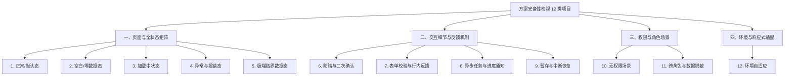

# 方案完备性检视 Checklist (v1.0)

> [!IMPORTANT]
> **定位与轻量执行方式说明：**
> - **本 Checklist 为【维度 4：方案完备性检视】的专项审查标准**。
> - **轻量审查原则（代码审查优先 + 耗时熔断机制）**：
>   1. **仅限静态代码审查 (Code-Only Review)**：本维度默认仅通过扫描源码/原型 DOM 代码特征（查 `loading`/`empty`/`ellipsis`/`confirm`/`catch` 代码标记）完成完备性闭环排查，禁止在浏览器中进行耗时的极端场景盲目遍历。
>   2. **定量耗时与规模熔断（Anti-Sloth）**：
>      - **触发熔断阈值**：仅当**源码单文件行数 > 5000 行**、或该维度走查耗时**累计评估/执行超过 8 分钟**时，触发主动熔断。
>      - **熔断后保底规范（严禁空手退出）**：触发熔断后停止深层链路遍历，但**必须基于已检索代码/DOM 进行核心标记抽检**（如快速检索 `loading|empty|catch|show-overflow|confirm` 关键标记），输出轻量定性结论并明确标注已核查文件与未覆盖范围，禁止输出空泛套话。
> - **明确不包含界面 UI 视觉还原打尺**（如像素级 Padding/Margin、组件 Radius、Hex 颜色还原等）。

---

## 0. 方案完备性 4 大板块 12 类项目索引

---

## 一、 页面与全状态矩阵 (State Matrix Completeness)

### 1. 正常 / 默认态 (Normal / Default State)
- [ ] **信息层级完备**: 典型数据量下，主/次要信息分区明确，操作入口显眼，无信息挤压或脱节。
- [ ] **默认选中与兜底**: 筛选项、下拉菜单、日期范围等是否均有合理的默认选中值（如默认“最近 7 天”或“全部”）。

### 2. 空白 / 零数据态 (Zero / Empty States)
- [ ] **初始化无数据**: 模块初次使用无数据时，是否提供插画/图标、清晰的无数据说明以及引导创建的按钮行动点？
- [ ] **筛选/搜索无结果**: 用户输入无效关键词或组合筛选条件无数据时，是否提示“未找到相关结果”，并提供“清空筛选”或“调整搜索条件”的快捷操作？
- [ ] **历史/列表清空态**: 数据被全部删除或清空后，是否优雅转入空白引导态而非留下空白表格骨架。

### 3. 加载中状态 (Loading States)
- [ ] **骨架屏 (Skeleton)**: 首屏或大块数据加载是否提供骨架屏，避免页面骤闪与布局抖动？
- [ ] **局部 Loading**: 表格翻页、树状展开、按钮提交等局部刷新是否有局部 Spin/Loading 反馈，且禁用重复触发？
- [ ] **全局/耗时遮罩**: 耗时超过 2 秒的重度加载是否有明确的进度百分比或“后台运行/取消”机制。

### 4. 异常与报错态 (Error & Exception States)
- [ ] **网络中断与超时**: 网络断开或 API 响应超时时，界面是否提供友好的网络异常提示页及“重新加载”按钮？
- [ ] **服务端 50x / 404 错误**: 接口报错时是否优雅拦截，展示建设性报错说明而非裸露 JSON 或崩溃白屏？
- [ ] **接口数据缺失/结构异常**: 依赖数据字段缺失（如 null/undefined）时，界面是否使用 `-` 或默认文本占位，避免 JS 抛错死锁。

### 5. 极端临界数据态 (Boundary / Edge Data States)
- [ ] **文本超长溢出**: 用户名、规则名称、长 URL 或 IP 范围超长时，是否配置省略号（Ellipsis）并支持 Hover Tooltip 显示全称？
- [ ] **海量数据/极长列表**: 表格数据上万条或节点数上百时，是否配置分页（Pagination）、虚拟滚动（Virtual Scroll）或 Top N 收纳，避免卡顿？
- [ ] **极限数值排版**: 极大值（如 `999,999+`）、负数、浮点数小数点截断及物理单位（KB/MB/GB）换算是否排版正常无错位。

---

## 二、 交互细节与反馈机制 (Interaction & Feedback Completeness)

### 6. 防错与二次确认 (Confirmation & Safety)
- [ ] **高危操作阻断**: 删除、批量解封、重启服务、覆盖配置等不可逆操作，是否有强模态二次确认弹窗？
- [ ] **风险操作文案告知**: 二次确认弹窗中是否明确告知后果（如：“删除后将无法恢复，关联的 3 条策略也将失效”）。
- [ ] **二次输入防误触**: 极高风险操作（如清空整个数据库/解绑租户）是否要求手动输入指定确认词（如输入 `DELETE`）。

### 7. 表单校验与行内反馈 (Form Validation)
- [ ] **实时失焦校验**: 输入框失焦（Blur）时是否实时校验格式（如 IP、域名、Port、邮箱），并在组件下方显示行内红色报错？
- [ ] **提交阻断与聚焦定位**: 表单校验不通过时提交按钮是否置灰或点击后自动定位到首个报错输入框？
- [ ] **自动清洗与纠错**: 用户复制前后带空格的字符串时，系统能否自动清洗去除外侧空格？

### 8. 异步任务与进度通知 (Async Operation & Notifications)
- [ ] **异步任务下发**: 导出报表、批量扫描、剧本下发等耗时任务是否允许用户离开当前页，并在全局顶部/消息中心后台运行？
- [ ] **状态即时感知**: 异步任务完成或失败时，站内 Toast 或消息中心是否有即时通知与一键跳转查看结果路径？

### 9. 暂存/草稿与中断恢复 (Draft & Session Recovery)
- [ ] **误关防丢失**: 复杂表单/多步骤向导填写中途点击取消或遮罩层时，是否有“确定离开？未保存的内容将丢失”的挽留提示？
- [ ] **草稿自动保存**: 复杂配置（如 SOAR 剧本编排、自定义报表）是否支持本地或服务端草稿自动暂存？

---

## 三、 权限与角色场景 (Permissions & Roles Completeness)

### 10. 无权限场景 (Permission Control)
- [ ] **操作入口置灰/说明**: 无权限操作的按钮是否有清晰的 Tooltip 说明（如：“需要超级管理员权限”），或遵循按需显隐策略？
- [ ] **无权限页面遮罩/引导**: 跨链接直接访问无权限页面时，是否展示专业的 403 页面并提供“申请权限”或“返回首页”入口？

### 11. 跨角色与数据脱敏 (Roles & Data Masking)
- [ ] **角色视图适配**: 运维角色（关注排查与详情）与管理角色（关注大盘与趋势）看到的默认视图是否合理隔离？
- [ ] **敏感数据脱敏**: 密钥、密码、身份证、完整手机号等敏感信息在界面上是否有星号 `***` 脱敏展示及“点击查看（需二次鉴权）”能力？

---

## 四、 环境与响应式适配 (Environment Adaptation)

### 12. 环境自适应 (Environment Adaptation)
- [ ] **屏幕分辨率与响应式**: 在 1920x1080、1440x900、1280x800 等不同分辨率下，页面核心模块无重叠，横/纵向滚动条出现时机合理。
- [ ] **多语言长字符空间**: 考虑英文/海外多语言适配，按钮、标签、表头文字拓展 30%-50% 长度时排版不错乱。
- [ ] **URL 刷新与状态保留 (Deep Linking)**：刷新页面或复制 URL 给他人访问时，当前的筛选条件、分页页码、Tab 切换状态能否恢复？
